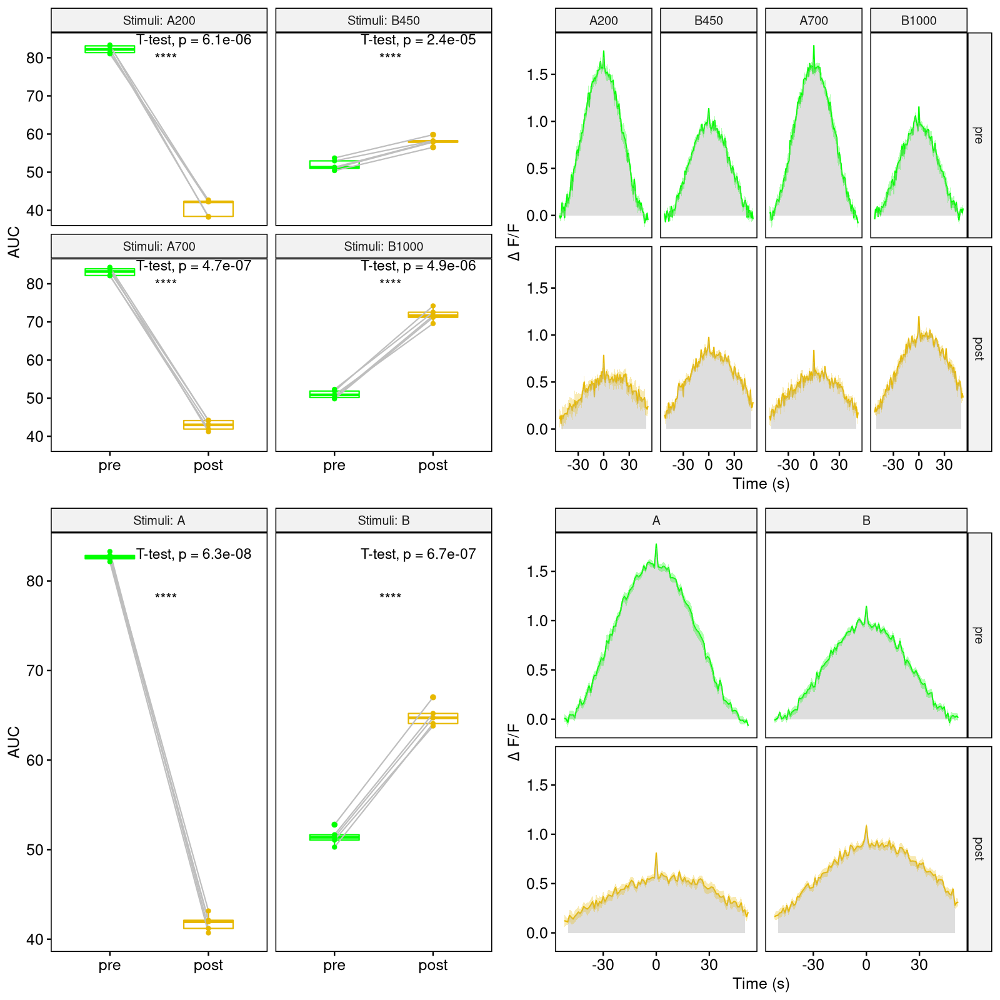

### Description

```{r description, eval=TRUE, echo=FALSE}
cat(NosaAnalysis:::get_analyser_objects(list(Auc=list()), list())$Auc$description)
```

### YAML configuration

For a general description of the yaml configuration see:

```{r, eval=FALSE}
vignette("BasicGuide", package = "NosaAnalysis")
```

1. [Sheets](#sheets)
2. [DataSettings](#datasettings)
3. [Output](#output)

### Sheets

```
  Sheets:
    metadata: []
    Processed: []
```

### DataSettings

```
  Stimulus:
    Time:
    - 200
    - 450
    - 700
    - 1000
    Name:
    - A
    - B
    - A
    - B
  PeakSearchWindow:
    BeforeStim: 0
    AfterStim: 100
  CalculationWindow:
    Start: 50
    End: 50
```

**Stimulus**: Values of the recording time units at which an event was triggered during the experimental recording. These time points are anchor points for a peak search and further calculations. Each stimulus must be named. If the names are the same, they are grouped together, otherwise they are considered as individual groups.

**PeakSearchWindow**: Not every living individual behaves the same way, so one individual's response to a stimulus may occur slightly earlier than another individual's response. Sometimes, however, you may want to focus on the level of fluorescence measured. For this purpose, a search window can be specified in which the highest value is searched for. This then serves as a peak for the calculation window. If one wants to examine the values at the same time points for each individual, then the values of **Start** and **End** are set to zero.

**CalculationWindow**: Defines the subsets of the data on which to perform the analyses. For each peak found, a time period is set for the calculation. For example, if "Start" is -2 and "End" is +2, then the calculation window is symmetrical around the peak and 4 time units in size.

### Output

```
Output:
  Auc:
    Sheet: Processed
    ControlPlots: yes
```

**ControlPlots**: Controls printing of trace plots associated with the boxplot data. The area from which the AUC was calculated is also plotted.

```{r, echo=FALSE}

```
