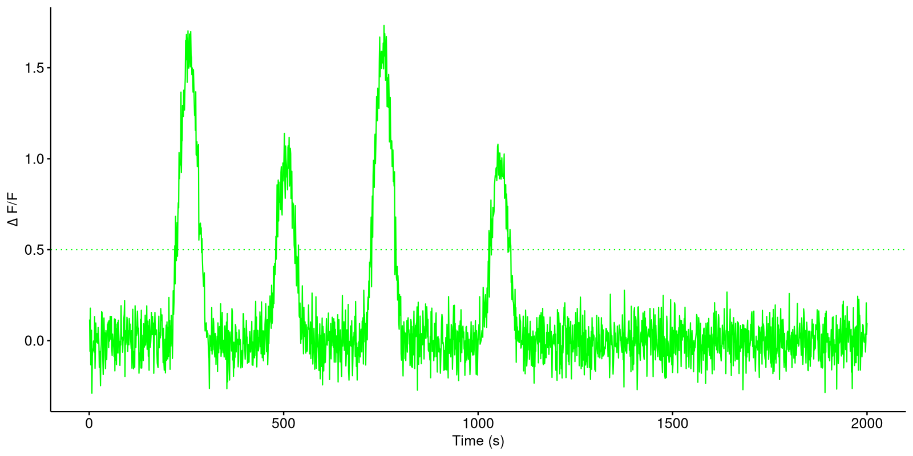

### Description

```{r description, eval=TRUE, echo=FALSE}
cat(NosaAnalysis:::get_analyser_objects(list(Trace=list()), list())$Trace$description)
```

### YAML configuration

For a general description of the yaml configuration see:

```{r, eval=FALSE}
vignette("BasicGuide", package = "NosaAnalysis")
```

1. [Sheets](#sheets)
2. [Output](#output)

### Sheets

```
  Sheets:
    metadata: []
    Processed: []
```


### Output

By specifying the following lines in the configuration `*.yaml` file the time sequence for each sample per specified sheet is plotted. Every plot is named 'Trace_SampleSourceName.png', where the SampleSourceName corresponds to the source name from the metadata sheet.

```
Output:
  Trace:
    Sheet: Processed
    Threshold: yes
```

Example plot with horizontal threshold line:

```{r, echo=FALSE, out.width="600px"}

```
